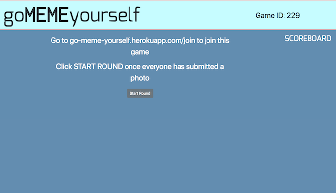
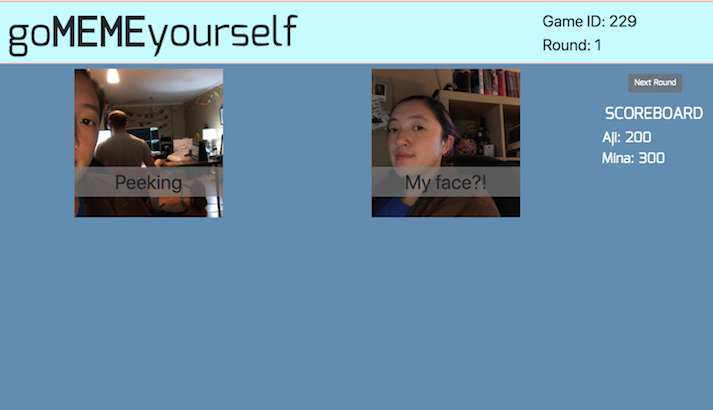
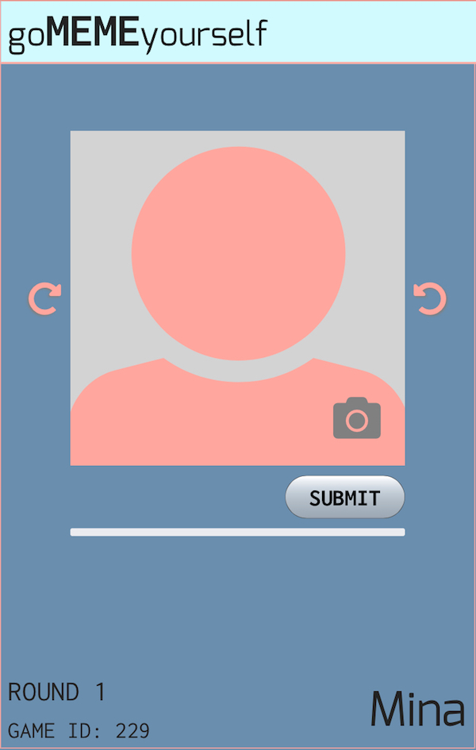

# GoMemeYourself

This project was created by two people that love playing games with their friends. What we've found to be the two biggest obstacles to game nights are: heavy technical requirements (consoles, controllers, etc.) and time. GoMemeYourself gets around both of those by using what you already have: a simple web browser on a TV or computer and you and your friends' mobile devices. Players join the game on their phones (or tablets) and snap a selfie. Once all the players have submitted their selfie, they're assigned a random selfie from one of their friends. They add a caption to that selfie and hit submit. After everyone's submitted a caption, all the newly-created memes are displayed on the screen and players get to vote on their favorite one. Players get points for votes on their captions *or* their photos.

## Preview

### TV/Computer

 

### Mobile

## Running the tests

open `public/test-runner.html` in browser to see result of unit tests

## Deployment

Game running live via Heroku [here](https://go-meme-yourself.herokuapp.com).

## Built With

* [Bootstrap](https://getbootstrap.com/docs/3.3/) - CSS library
* [Firebase](firebase.google.com) - Provides realtime communication for game data
* [JawsDB MySQL](https://elements.heroku.com/addons/jawsdb) - Heroku add-on that provides MySQL database server
* [jQuery](https://jquery.com) - Dom manipulation library

## Authors

* **Joe Fitzpatrick** - [GitHub](https://github.com/joefitz12)
* **Mina Slater** - [GitHub](https://github.com/minaslater)

## License

This project is licensed under the MIT License - see the [LICENSE.md](LICENSE.md) file for details

## Acknowledgments

* Hat tip to anyone who's code was used
* Inspiration
* etc
